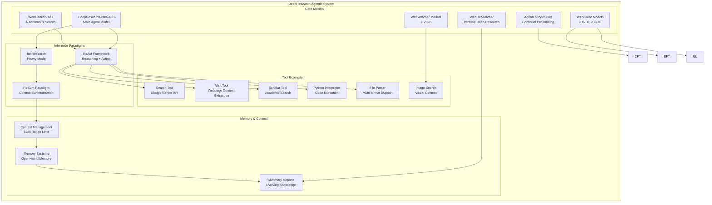
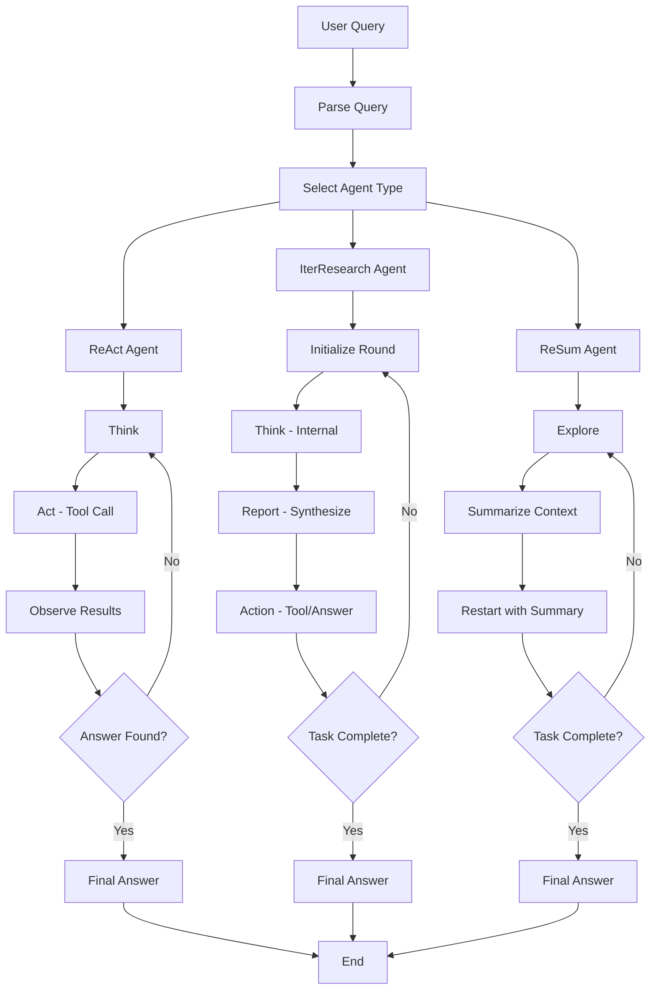
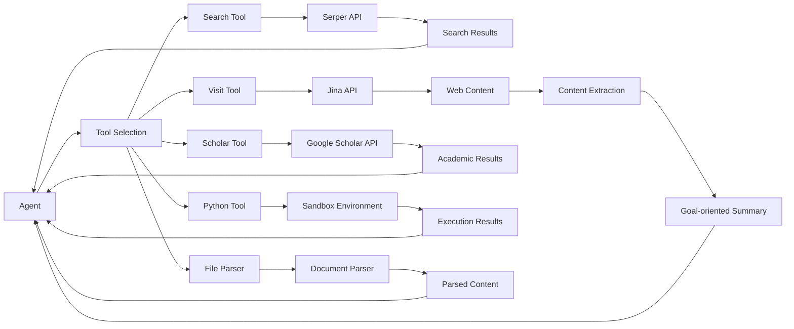
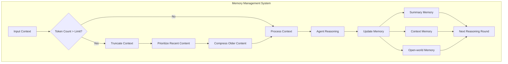

# DeepResearch Agentic System Architecture Documentation

## Table of Contents
1. [System Overview](#system-overview)
2. [Agent Types and Roles](#agent-types-and-roles)
3. [Tool Ecosystem](#tool-ecosystem)
4. [Workflow Patterns](#workflow-patterns)
5. [Memory Management](#memory-management)
6. [Training Pipeline](#training-pipeline)
7. [Inference Paradigms](#inference-paradigms)
8. [Agent Cooperation Mechanisms](#agent-cooperation-mechanisms)
9. [System Architecture Diagrams](#system-architecture-diagrams)

## System Overview

The DeepResearch agentic system is a comprehensive framework for autonomous information seeking and deep research tasks. Built by Tongyi Lab (Alibaba Group), it represents a sophisticated multi-agent architecture designed to handle complex, long-horizon research tasks through specialized agents, tools, and inference paradigms.

### Key Characteristics:
- **Multi-Agent Architecture**: Specialized agents for different research domains
- **Tool-Rich Environment**: Comprehensive set of tools for web search, content analysis, and computation
- **Advanced Memory Management**: Context summarization and open-world memory systems
- **Multiple Inference Paradigms**: ReAct, IterResearch, and ReSum approaches
- **Continual Learning**: Agentic continual pre-training (Agentic CPT) capabilities

## Agent Types and Roles

### 1. Core Research Agents

#### DeepResearch-30B-A3B (Main Agent)
- **Role**: Primary research agent for general deep research tasks
- **Capabilities**: 30.5B total parameters, 3.3B activated per token
- **Specialization**: Long-horizon, deep information-seeking tasks
- **Context Length**: 128K tokens
- **Performance**: State-of-the-art on multiple benchmarks (GAIA, BrowserComp, WebWalkerQA, etc.)

#### AgentFounder-30B
- **Role**: Continual pre-training specialist
- **Capabilities**: Agentic Continual Pretraining (Agentic CPT)
- **Specialization**: Scaling agents via continual pre-training
- **Training Strategy**: Two-stage continual pre-training (32K and 128K contexts)
- **Data Synthesis**: FAS (Planning Action Synthesis), HAS (Decision-Making Action Synthesis)

### 2. Specialized Web Agents

#### WebSailor Models (3B/7B/32B/72B)
- **Role**: Web navigation and information-seeking specialist
- **Capabilities**: Super-human reasoning for web agents
- **Specialization**: Complex web navigation with high uncertainty
- **Training**: SailorFog-QA dataset, DUPO (Duplicating Sampling Policy Optimization)
- **Performance**: SOTA on BrowseComp-en/zh benchmarks

#### WebWatcher Models (7B/32B)
- **Role**: Vision-language deep research agent
- **Capabilities**: Multimodal reasoning with visual and textual content
- **Specialization**: Visual search, image analysis, multimodal VQA
- **Tools**: Web Image Search, Web Text Search, Code Interpreter, OCR
- **Performance**: Leading on HLE-VL, BrowseComp-VL, LiveVQA benchmarks

#### WebResearcher
- **Role**: Iterative deep-research specialist
- **Capabilities**: Unbounded reasoning through iterative synthesis
- **Specialization**: Complex research tasks requiring sustained reasoning
- **Paradigm**: Iterative Deep-Research with periodic synthesis
- **Memory**: Evolving summary reports as central memory

#### WebDancer-32B
- **Role**: Autonomous information seeking agency
- **Capabilities**: Native agentic search reasoning
- **Specialization**: Long-horizon tasks with multiple steps
- **Training**: Four-stage paradigm (browsing data, trajectory sampling, SFT, RL)
- **Performance**: 64.1% Pass@3 on GAIA, 62.0% on WebWalkerQA

### 3. Supporting Agents

#### WebShaper-32B
- **Role**: Data synthesis specialist
- **Capabilities**: Agentically data synthesizing via information-seeking formalization
- **Specialization**: Systematic generation of IS instances
- **Method**: Formalization-driven data synthesis

#### WebWalker
- **Role**: Web traversal benchmarking
- **Capabilities**: Multi-agent framework for information seeking
- **Specialization**: Web traversal and benchmarking

## Tool Ecosystem

### 1. Search and Information Retrieval Tools

#### Search Tool
- **Function**: Google web search via Serper API
- **Capabilities**: 
  - Batched web searches (multiple queries in one call)
  - Location-aware search (China/US based on query language)
  - Top 10 results per query
  - Automatic retry mechanism (5 attempts)
- **Input**: Array of query strings
- **Output**: Formatted search results with titles, snippets, sources, dates

#### Scholar Tool
- **Function**: Academic publication search via Google Scholar
- **Capabilities**:
  - Academic paper retrieval
  - Citation information
  - PDF URL access
  - Publication metadata
- **Input**: Array of academic search queries
- **Output**: Academic results with publication info, citations, abstracts

### 2. Content Analysis Tools

#### Visit Tool
- **Function**: Webpage content extraction and summarization
- **Capabilities**:
  - Multi-URL processing
  - Content extraction via Jina API
  - Goal-oriented summarization
  - Evidence extraction and synthesis
- **Input**: URLs and specific goals
- **Output**: Structured summaries with evidence and rational sections
- **Features**: Token truncation (95K limit), retry mechanisms, content filtering

#### File Parser Tool
- **Function**: Multi-format document parsing
- **Supported Formats**: PDF, DOCX, PPTX, TXT, CSV, XLSX, DOC, ZIP, MP4, MP3
- **Capabilities**:
  - Structured document extraction
  - Table and image processing
  - Schema extraction for large files
  - Caching for performance
- **Processing**: IDP integration, token counting, content compression

### 3. Computation Tools

#### Python Interpreter
- **Function**: Sandboxed Python code execution
- **Capabilities**:
  - Multi-endpoint execution
  - Timeout handling (50s default)
  - Error capture and reporting
  - Random endpoint selection for load balancing
- **Security**: Sandboxed environment, execution time limits
- **Output**: stdout/stderr capture with execution metadata

### 4. Visual Processing Tools

#### Image Search Tool (WebWatcher)
- **Function**: Visual content search and analysis
- **Capabilities**:
  - Web image search
  - OCR processing
  - Visual question answering
  - Multimodal reasoning

## Workflow Patterns

### 1. ReAct Framework (Reasoning + Acting)

The primary workflow pattern used across most agents:

```
1. Think: Internal reasoning and planning
2. Act: Tool call execution
3. Observe: Process tool results
4. Repeat: Continue until answer found
```

**Implementation Details**:
- Maximum 100 LLM calls per run
- 150-minute timeout limit
- Token limit management (108K tokens)
- Automatic context truncation when limits exceeded

### 2. IterResearch Paradigm (WebResearcher)

Advanced iterative approach for complex research:

```
1. Round Initialization: Create lean workspace
2. Think: Internal reasoning (not passed forward)
3. Report: Synthesize findings into evolving summary
4. Action: Tool call or final answer
5. Round Completion: Update central memory
6. Repeat: Continue with reconstructed workspace
```

**Key Benefits**:
- Prevents cognitive workspace suffocation
- Eliminates noise contamination
- Enables sustained deep reasoning
- Maintains focused cognitive workspace

### 3. ReSum Paradigm (Context Summarization)

Memory-efficient approach for long-horizon tasks:

```
1. Exploration: Initial research phase
2. Summarization: Compress conversation history
3. Restart: Continue with compressed context
4. Iteration: Repeat summarization cycles
```

**Components**:
- ReSumTool-30B: Specialized summarization model
- ReSum-GRPO: Tailored RL algorithm
- Periodic compression: Maintains context efficiency

## Memory Management

### 1. Context Management

#### Token Limits and Truncation
- **Maximum Context**: 128K tokens for main models
- **Truncation Strategy**: Automatic truncation when limits exceeded
- **Content Prioritization**: Recent content preserved, older content compressed

#### Context Reconstruction
- **Workspace Reconstruction**: Lean context for each reasoning round
- **Selective Information**: Only relevant information carried forward
- **Memory Efficiency**: Prevents context window overflow

### 2. Open-World Memory System

#### Continuous Data Streams
- **Real-time Updates**: Continuously updated data streams
- **Memory Integration**: Transform streams into open-world memory
- **Diverse QA Styles**: Synthesis of various question-answer patterns

#### Memory Synthesis
- **Knowledge Integration**: Combine multiple information sources
- **Temporal Awareness**: Maintain awareness of information recency
- **Contextual Relevance**: Filter information based on current goals

### 3. Summary Reports (WebResearcher)

#### Evolving Central Memory
- **Synthesis Process**: New findings integrated into summary
- **High-Density Storage**: Concise, coherent summaries
- **Forward Propagation**: Summary carried to next reasoning round

#### Report Structure
- **Evidence Section**: Full original context of relevant information
- **Summary Section**: Organized, logical flow with contribution assessment
- **Rational Section**: Specific sections related to user goals

## Training Pipeline

### 1. Data Synthesis

#### Scalable Data Generation
- **Automated Pipeline**: Fully automatic data synthesis
- **Multi-Agent Framework**: ItemWriter, QuestionSolver, Judge agents
- **Quality Control**: Rigorous filtering and validation

#### Data Types
- **FAS (Planning Action Synthesis)**: Reasoning-action data from QA instances
- **HAS (Decision-Making Action Synthesis)**: Multi-step decision-making processes
- **SailorFog-QA**: High-uncertainty, complex knowledge graphs
- **Iterative Complexity Escalation**: Progressive difficulty increase

### 2. Training Stages

#### Supervised Fine-Tuning (SFT)
- **RFT Cold Start**: Rejection sampling fine-tuning
- **High-Quality Trajectories**: Expert trajectory reconstruction
- **Clean Supervision**: Concise, action-oriented signals

#### Reinforcement Learning (RL)
- **GRPO (Group Relative Policy Optimization)**: On-policy RL approach
- **DUPO (Duplicating Sampling Policy Optimization)**: Efficient agentic RL
- **RLVR (Reinforcement Learning with Verifiable Rewards)**: Verifiable reward signals
- **Token-level Policy Gradients**: Granular optimization

#### Continual Pre-training (CPT)
- **Agentic CPT**: First continual pre-training for agents
- **Two-stage Strategy**: 32K and 128K context training
- **Open-world Memory**: Continuous data stream integration

### 3. Test-Time Scaling (TTS)

#### Last-k-Fusion
- **Multiple Rollouts**: Parallel inference execution
- **Fusion Agent**: Synthesize final answers from critical steps
- **Performance Boost**: Enhanced accuracy through ensemble methods

## Inference Paradigms

### 1. ReAct Mode
- **Purpose**: Rigorous evaluation of core intrinsic abilities
- **Implementation**: Standard reasoning-action-observation loop
- **Use Case**: Benchmark evaluation, capability assessment

### 2. IterResearch Heavy Mode
- **Purpose**: Maximum performance ceiling unlock
- **Implementation**: Test-time scaling with multiple rollouts
- **Use Case**: Production deployment, complex research tasks

### 3. ReSum Mode
- **Purpose**: Unlimited exploration with memory efficiency
- **Implementation**: Periodic context summarization
- **Use Case**: Long-horizon tasks, memory-constrained environments

## Agent Cooperation Mechanisms

### 1. Multi-Agent Framework

#### Specialized Agent Deployment
- **Domain Expertise**: Each agent specialized for specific tasks
- **Tool Sharing**: Common tool ecosystem across agents
- **Performance Optimization**: Right agent for right task

#### Coordination Patterns
- **Sequential Processing**: Agents work in sequence for complex tasks
- **Parallel Execution**: Multiple agents handle different aspects
- **Result Aggregation**: Combine outputs from multiple agents

### 2. Tool Orchestration

#### Dynamic Tool Selection
- **Context-Aware**: Tools selected based on current context
- **Capability Matching**: Tool capabilities matched to task requirements
- **Fallback Mechanisms**: Alternative tools when primary tools fail

#### Tool Chaining
- **Sequential Execution**: Tools used in logical sequence
- **Result Propagation**: Output from one tool feeds into next
- **Error Handling**: Graceful degradation when tools fail

### 3. Memory Coordination

#### Shared Memory Systems
- **Context Sharing**: Relevant context shared between agents
- **Summary Propagation**: Summaries passed between agents
- **Knowledge Integration**: Combined knowledge from multiple agents

## System Architecture Diagrams

### Overall System Architecture



### Agent Workflow Diagram



### Tool Interaction Flow



### Memory Management Architecture



## Conclusion

The DeepResearch agentic system represents a sophisticated, multi-layered architecture for autonomous information seeking and deep research. Through its specialized agents, comprehensive tool ecosystem, advanced memory management, and multiple inference paradigms, it achieves state-of-the-art performance on complex research benchmarks while maintaining efficiency and scalability.

The system's key innovations include:
- **Multi-agent specialization** for different research domains
- **Advanced memory management** with context summarization
- **Continual learning capabilities** through agentic CPT
- **Flexible inference paradigms** for different use cases
- **Comprehensive tool ecosystem** for diverse information sources

This architecture enables the system to handle complex, long-horizon research tasks that would be challenging for traditional single-agent approaches, while maintaining efficiency through intelligent memory management and context optimization.