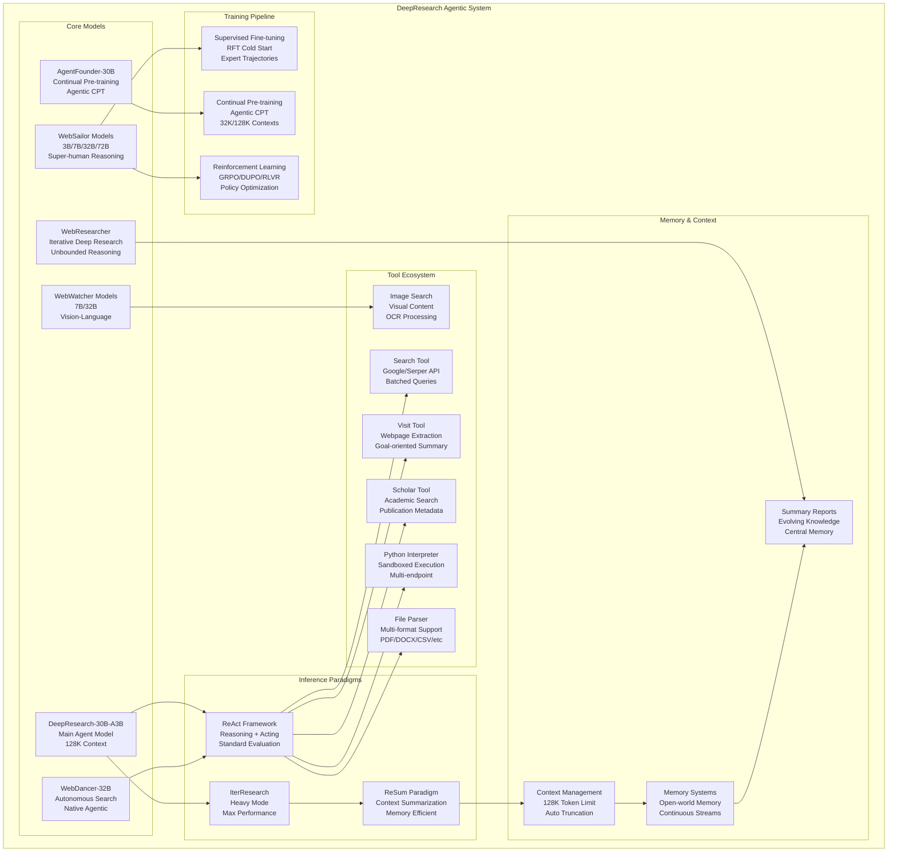
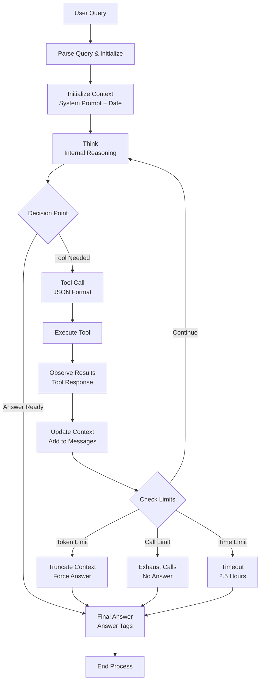
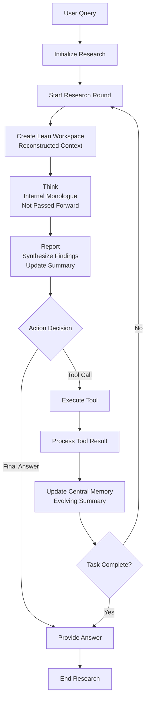
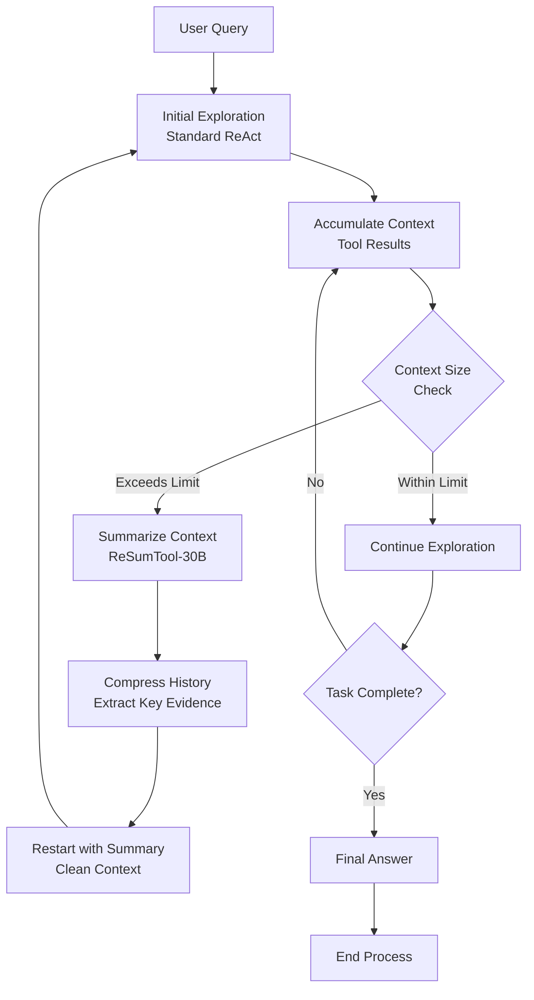
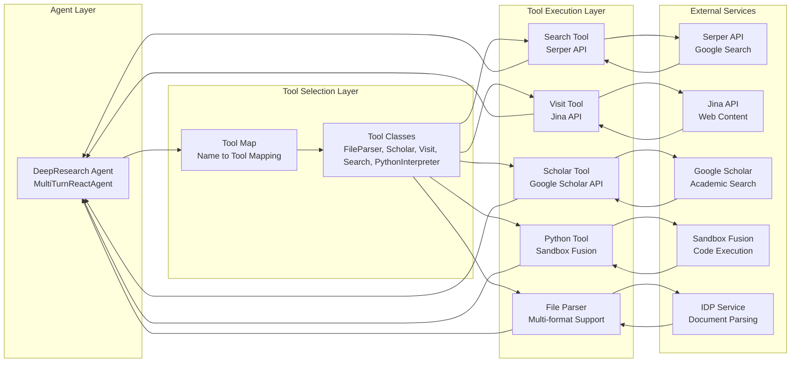
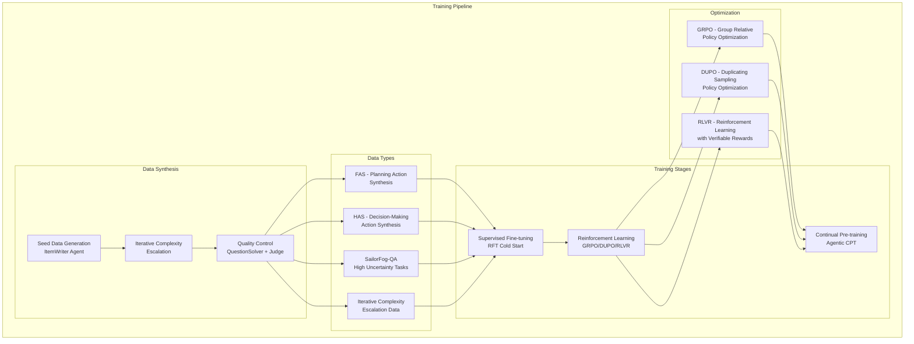
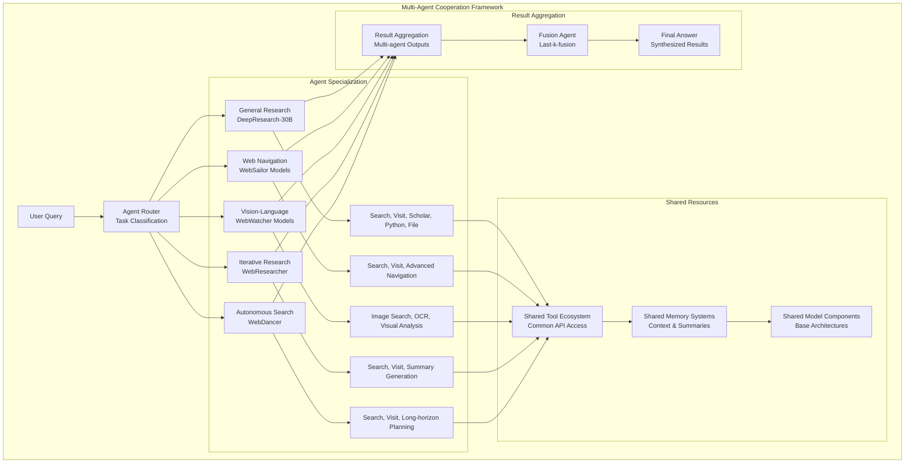
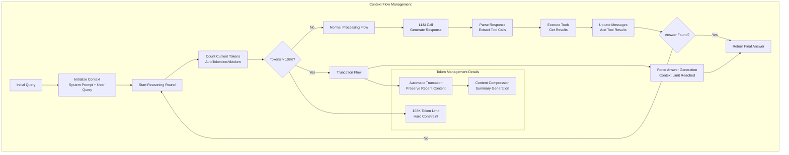
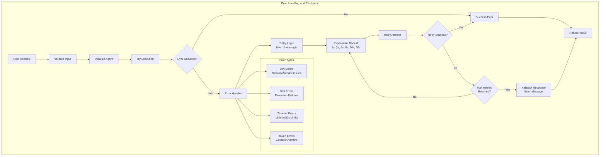

# DeepResearch System Architecture Diagrams

This document contains detailed Mermaid diagrams illustrating the DeepResearch agentic system architecture, workflows, and component interactions.

## 1. Overall System Architecture

## 2. Agent Workflow Patterns

### ReAct Framework Workflow

### IterResearch Paradigm Workflow

### ReSum Paradigm Workflow

## 3. Tool Interaction Architecture

## 4. Memory Management System

```mermaid
graph TB
    subgraph "Memory Management Architecture"
        INPUT[Input Context<br/>Messages + Tool Results]
        
        INPUT --> TOKEN_COUNT[Count Tokens<br/>AutoTokenizer/tiktoken]
        TOKEN_COUNT --> CHECK_LIMIT{Token Count > 108K?}
        
        CHECK_LIMIT -->|No| PROCESS[Process Context<br/>Normal Flow]
        CHECK_LIMIT -->|Yes| TRUNCATE[Truncate Context<br/>Preserve Recent]
        
        TRUNCATE --> PRIORITIZE[Prioritize Content<br/>Recent First]
        PRIORITIZE --> COMPRESS[Compress Older Content<br/>Summary Generation]
        COMPRESS --> PROCESS
        
        PROCESS --> REASONING[Agent Reasoning<br/>LLM Processing]
        REASONING --> TOOL_CALL[Tool Call Generation]
        TOOL_CALL --> TOOL_EXEC[Tool Execution]
        TOOL_EXEC --> RESULT[Tool Results]
        
        RESULT --> UPDATE_CONTEXT[Update Context<br/>Add to Messages]
        UPDATE_CONTEXT --> MEMORY_UPDATE[Update Memory Systems]
        
        MEMORY_UPDATE --> SUMMARY_MEM[Summary Memory<br/>Evolving Reports]
        MEMORY_UPDATE --> CONTEXT_MEM[Context Memory<br/>Conversation History]
        MEMORY_UPDATE --> OPEN_MEM[Open-world Memory<br/>Continuous Streams]
        
        SUMMARY_MEM --> NEXT_ROUND[Next Reasoning Round]
        CONTEXT_MEM --> NEXT_ROUND
        OPEN_MEM --> NEXT_ROUND
    end
```

## 5. Training Pipeline Architecture

## 6. Multi-Agent Cooperation

## 7. Context Flow and Token Management

## 8. Error Handling and Resilience

These diagrams provide a comprehensive visual representation of the DeepResearch agentic system architecture, showing how different components interact, how workflows are structured, and how the system handles various scenarios including error conditions and resource management.